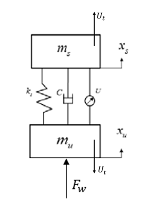

# BirdsModel
### Description

Using Reinforcement Learning to control birds head(active control of 2-DOF spring-damping system)

The idea of using 2-DOF spring damping system to describe bird head model is came from:

Pete AE, Kress D, Dimitrov MA, Lentink D. 2015 The role of passive avian head stabilization in flapping flight. J. R. Soc.
Interface 12: 20150508. http://dx.doi.org/10.1098/rsif.2015.0508  

In this paper, researcher use such model to describe avian head.

   
     

For traditional 2DOF problems like following graphs, we can derive the dynamic equations like:

   
     

$$
m_s \ddot{x_s} + c(\dot{x_s}-\dot{x_u}) + k_s(x_s-x_u) = U_t
$$

$$
m_u \ddot{x_u} + c(\dot{x_u} -\dot{x_s}) + k_s(x_u - x_s) + U_t = F_w
$$

Then we can construct environment based on the dynamic equations, the parameters are:

- k = 20N/m
- Passive damping coefficient c = 0.01 (c = 4 for comparison)
- ms = 0.5kg
- mu = 1.5kg
- spring length in static equilibrium state: 0.4m

In addition to dynamic characteristic, the reward functions is a key factor to determine the efficiency of control algorithms, I use :
$$
\text{reward} = \text{clip}(\frac{v_{max} - R*v_{head}}{v_{max}-v_{min}})
$$

### Results

using DQN and PG to train, it turns out that PG get a better result, the q value sum is:

   
     

   
     

To visualize it using gym:

   
     

### Requirement

Tensorfow 1.x

numpy

matplotlib....
